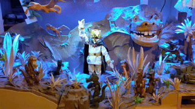

# Drachenland



## About the Project

This project controls an interactive diorama featuring a central Dragon King puppet and surrounding dragon/serpent figures. The exhibit can be seen during January and February 2025 at:

> Goldschmied Armin Limacher  
> Pilatusstrasse 23  
> 6003 Luzern  
> [Website](https://goldschmied-limacher.ch/kontakt/)

### Features

- Real-time visitor interaction using computer vision
- The puppet looks at visitors as they move around
- Detection when the visitor waves at the puppet to trigger animations
- Multiple pre-programmed dance animations
- Web-based maintenance interface
- Animation creation GUI with keyframe support

### Privacy

- All processing is done on-device
- No image data is stored
- Web interface is only available locally
- No internet connection required

## Technical Details

### Hardware Requirements

- Raspberry Pi
- Servo motors for puppet control
- Camera for pose detection
- GPIO switches for manual control
- LED indicators

### Software Components

- Python-based control system
- [MediaPipe](https://ai.google.dev/edge/mediapipe/solutions/vision/pose_landmarker) for real-time on-device pose detection
- Flask-based web interface
- Custom animation system
- State machine for behavior control

## Installation

Although it's unlikely the same hardware setup will ever be replicated, this is how you would install the software on your device:

```bash
# Clone the repository
git clone [repository-url]

# Install dependencies
pip install -r requirements.txt

# Configure GPIO pins
cp config/default.json.example config/default.json
# Edit config/default.json to match your GPIO setup
```

## Usage

### Starting the System

```bash
python main.py --config config/default.json
```

### Web Interface

Access the maintenance interface at:
```
http://[raspberry-pi-ip]:5001
```

### Manual Controls

The system includes physical controls:
- Start switch: Manually triggers animation, the same as if a visitor is waving at the puppet
- Test switch: Starts a test animation
- Freigabe switch: Override that turns off all animations

### Creating Animations

1. Access the animation GUI through the web interface
2. Create keyframes for desired movements and export it
3. Put the exported `.json` file into the `animations/` directory
